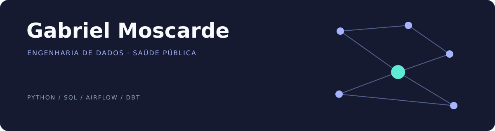

## Oi, eu sou o Gabriel 👋

Sou engenheiro de dados na **Secretaria Municipal de Saúde do Rio de Janeiro**. Meu dia a dia envolve conectar sistemas, organizar dados de saúde e construir pipelines que alimentam análises para a gestão pública.

Gosto de entender o caminho inteiro: de onde o dado vem, o que precisa acontecer no meio e como ele chega a quem vai usar. Nesse percurso, trabalho com integração, orquestração, modelagem e qualidade de dados — e às vezes descubro que o problema era um espaço no nome da coluna.

[**🌐 Portfólio**](https://portifolio-moscarde.vercel.app/) · [**💬 LinkedIn**](https://www.linkedin.com/in/moscarde/) · [**✍️ Artigos**](https://moscarde.medium.com/)

### 🧰 Na bancada

| Para fazer o quê? | Com o quê? |
| --- | --- |
| Buscar e conectar dados | Python · SQL · APIs · Airbyte |
| Colocar as rotinas para rodar | Apache Airflow · Docker |
| Transformar e modelar | dbt · PostgreSQL · pandas · Polars · DuckDB |
| Entregar aplicações e análises | Django · Flask · Looker Studio |

### 🤖 Também tem IA no workflow

**Claude e Codex** fazem parte da minha caixa de ferramentas de desenvolvimento. Entre código, ideias e documentação, também exploro como trabalhar com agentes de IA no dia a dia da engenharia de dados.

> A IA sugere. Eu reviso. O pipeline dá seu parecer às 3 da manhã.

### 🔎 O que você encontra por aqui

Dados públicos de saúde, experimentos com ferramentas de processamento, arquitetura de BI e aprendizados de implementação. Gosto de transformar uma dúvida técnica em um projeto que dê para abrir, entender e testar.

**Alguns desses projetos estão fixados logo abaixo. ↓**
